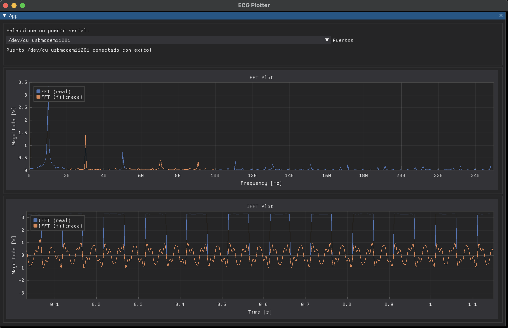

# ecg_digital_filter

Implementacion de un filtro digital para un ECG en un RP2040

## Intrucciones para el firmware del RP2040

Se incluye el código fuente del microcontrolador que se encarga de muestrear periódicamente una señal de ECG y mandarla por USB a la interfaz.

### Requisitos

Una Raspberry Pi Pico o una placa de desarrollo con un RP2040.

El firmware para grabar directamente en el microcontrolador se encuentra en el directorio [firmware](firmware).

Si quisieran hacerse modificaciones, es necesario tener Visual Studio Code con la extensión [PlatformIO](https://platformio.org/) instalada y la plataforma de este [repositorio](https://github.com/maxgerhardt/wizio-pico.git) instalada.

El código fuente para editar con la extensión PlatformIO puede encontrarse en el directorio [rp2040_c].

## Instrucciones para plotter

Este repo incluye una interfaz para ver en "tiempo real" lo muestreado por el microcontrolador y el resultado de la FFT y filtro digital.

### Requisitos

Tener instalado `Python 3` con su version mas reciente de `pip`. Podemos instalar Python desde su [pagina](https://www.python.org/) y luego, en una consola escribir:

```bash
python3 -m pip install --upgrade pip
python3 -m pip --version
```

### Conexiones

Hay dos alternativas presentadas en el código fuente que pueden usarse. Es posible usar el canal 0 del ADC ubicado en el GPIO26 del RP2040 conectándolo a una salida del ECG acondicionada para estar entre 0 y 3.3V.

También es posible realimentar el GPIO16 que está generando una salida de PWM de 10Hz al 50% de ancho de pulso al mismo canal analógico para poder probar la interfaz.

| Funcionamiento | Entrada | Señal medida |
| --- | --- | --- |
| Normal | GPIO26 | Salida de ECG acondicionada |
| Prueba | GPIO26 | Salida de PWM en GPIO16 |

## Entorno virtual

Para esta interfaz, vamos a hacer uso de un entorno virtual para instalar algunos paquetes. Para eso, vamos a abrir una terminal dentro de este repositorio y entrar a `plotter`:

```bash
cd plotter
```

Para crear el entorno virtual podemos escribir:

```bash
python3 -m venv .env
```

Luego, activamos el entorno virtual con:

```bash
source .env/bin/activate
```

Y finalmente, instalamos los paquetes con:

```bash
python -m pip install -r requirements.txt
```

Ahora, podemos usar la interfaz corriendo:

```bash
python plotter_app.py
```

Cuando hayamos terminado, podemos desactivar el entorno virtual con:

```bash
deactivate
```

### Uso del plotter

Una vez que esté corriendo la interfaz, requeriremos que este conectado el microcontrolador a algún puerto de la computadora. Si éste se encuentra, debemos seleccionarlo del menú desplegable y luego comenzara a mostrarse la información recibida.

